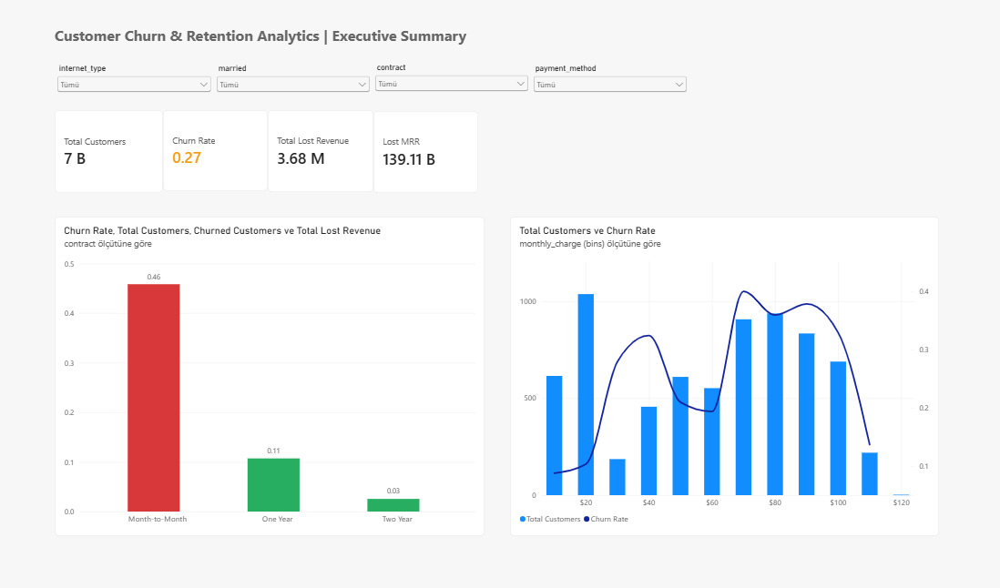
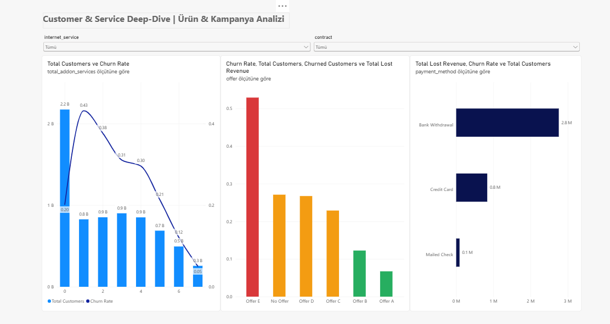
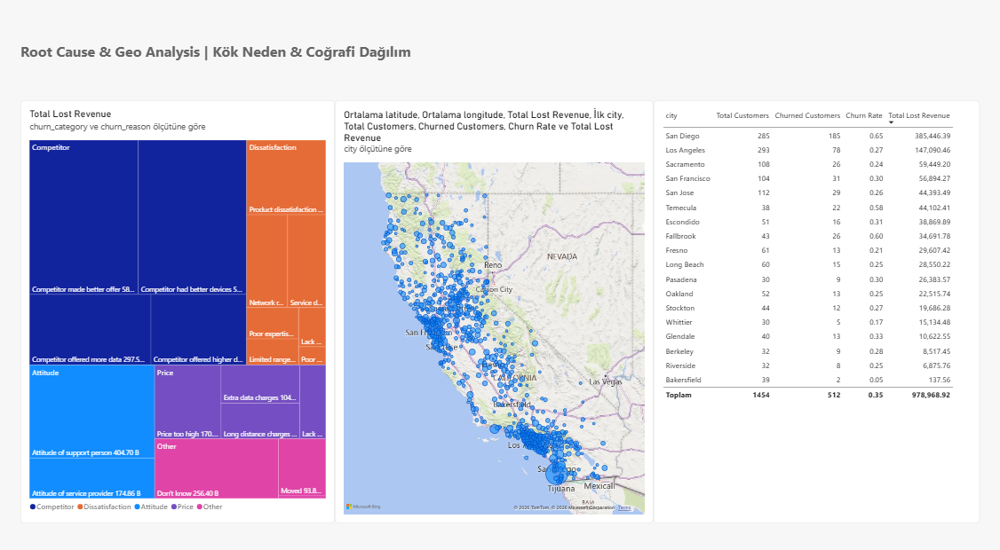

# 📊 Telecom Customer Churn & Retention Analytics

> An end-to-end Enterprise Data Analytics & Business Intelligence project featuring Data Pipeline ETL, Star Schema Data Warehousing on PostgreSQL, Statistical Hypothesis Testing, and Executive Power BI Dashboards.

---

## 📌 Project Overview

Customer Churn is one of the most critical challenges in the subscription-based telecommunications industry. This project aims to identify churn drivers, uncover high-risk customer segments, evaluate the stickiness of value-added services, and deliver actionable executive decision-support tools.

The project encompasses the complete data lifecycle:
1. **Data Cleaning & Feature Engineering**: Handled anomalies, missing values, and created business segments.
2. **Data Warehousing (Star Schema)**: Architected relational dimension and fact models in PostgreSQL with enforced referential integrity.
3. **Statistical Hypothesis Testing (EDA)**: Conducted Chi-Square tests of independence and Two-Proportion Z-Tests to validate retention hypotheses.
4. **Business Intelligence & Dashboards**: Built multi-tier interactive Power BI reports providing executive KPI summaries, deep-dive service diagnostics, and geospatial root-cause analytics.

---

## 🏗️ Architecture & Pipeline Flow

```
[Raw Data: CSV Sources]
         │
         ▼
[Data Cleaning & Feature Engineering (Pandas)]
         │
         ▼
[PostgreSQL Staging Layer (stg_telecom_churn)]
         │
         ▼
[Relational Star Schema Data Warehouse]
  ├── dim_customer      (Demographics & Dynamic Household Size)
  ├── dim_location      (City, Zip Code, Geo-Coordinates, Population)
  ├── dim_subscription  (Contracts, Internet & Value-Added Services)
  └── fact_churn        (Tenure, ARPU, Revenue, Charges, Refunds, Churn Status)
         │
         ▼
[Analytical Reporting View (vw_powerbi_telecom_model)]
         ├──────────────────────────────┬──────────────────────────────┐
         ▼                                                             ▼
[Interactive Power BI Dashboards]                         [Python EDA & Hypothesis Tests]
  • Executive KPI Summary                                   • Contract Risk Discrepancy
  • Service & Feature Deep Dive                             • Add-on Service Stickiness
  • Root Cause & Geospatial Insights                        • Payment Method Z-Tests
```

---

## 💡 Key Business Insights

### 1. Contract Type Impact (18x Risk Difference)
* **Month-to-month** subscribers face an alarming **45.8% churn rate**, while **2-year contract** customers churn at only **2.5%** — representing an **18-fold risk differential**.
* Month-to-month contracts account for over **88% of total churned customers** and over **$2.5M in lost revenue**.

### 2. The Critical Tenure Window (First 6 Months)
* Churn is acutely concentrated in the first **0–6 months** of customer lifecycle (**over 50% churn rate**).
* Customers who surpass the 24-month mark demonstrate exponential loyalty, with churn dropping below 10%. Onboarding intervention programs during the first 90 days are critical.

### 3. Service Stickiness & Ecosystem Effect
* Customers with **solo internet** (0 add-ons) exhibit a **50.4% churn rate**.
* Subscribing to value-added services (Online Security, Premium Tech Support, Online Backup) reduces churn rate to single digits (<8%), proving a strong ecosystem lock-in effect.

### 4. Referral Ambassador Program
* Customers with zero referrals have a churn rate above **30%**.
* Customers who provide 5+ referrals ("Brand Advocates") have an astonishing **~0% churn rate**, underscoring referral incentives as a primary retention lever.

### 5. Payment Methods & Statistical Significance
* Customers paying via **Bank Withdrawal** churn at **34.0%**, compared to **14.5%** for **Credit Card** autopay.
* A **Two-Proportion Z-Test** confirmed this difference is highly statistically significant ($Z = 17.89, p < 0.0001$).
* **Fiber Optic churn drivers**: Root-cause analysis revealed that churn is primarily driven by competitor price/promotions (over 40%) and customer support attitude rather than network speed deficits.

---

## 📈 Power BI Executive Dashboards

The interactive Power BI dashboard ([`powerbi/customer_churn_dashboard.pbix`](file:///c:/Users/deniz/OneDrive/Masaüstü/customer-churn-retention-analytics/powerbi/customer_churn_dashboard.pbix)) provides 3 targeted perspectives:

### 1. Executive KPI Summary
High-level overview displaying churn rate, lost revenue, customer distribution, contract risks, and financial KPIs.



---

### 2. Customer & Service Deep Dive
In-depth diagnostic examining internet types, value-added security features, marketing offers (Offer A–E), and service depth.



---

### 3. Root Cause & Geospatial Analysis
Categorical breakdown of churn drivers (Competitor, Price, Attitude, Network) mapped across geographic California zip codes and metropolitan areas.



---

## 🗄️ Data Warehouse: Star Schema Design

| Table Name | Entity Type | Key Attributes & Description |
|---|---|---|
| `dim_customer` | Dimension | `customer_id` (PK), `gender`, `age`, `age_group`, `married`, `number_of_dependents`, `household_size` (dynamically computed). |
| `dim_location` | Dimension | `zip_code` (PK), `city`, `latitude`, `longitude`, `population`. |
| `dim_subscription` | Dimension | `customer_id` (PK/FK), `offer`, `contract`, `payment_method`, `paperless_billing`, `phone_service`, `multiple_lines`, `internet_service`, `internet_type`, 7 add-on services, `total_addon_services`. |
| `fact_churn` | Fact | `customer_id` (PK/FK), `zip_code` (FK), `tenure_in_months`, `tenure_group`, `number_of_referrals`, `referral_group`, `monthly_charge`, `monthly_arpu`, `total_charges`, `total_refunds`, `total_revenue`, `customer_status`, `churn_category`, `churn_reason`, `is_churned`. |

---

## 📁 Repository Structure

```
customer-churn-retention-analytics/
├── data/
│   ├── raw/                           # Raw input datasets
│   │   ├── telecom_customer_churn.csv
│   │   └── telecom_zipcode_population.csv
│   └── cleaned/                       # Processed & feature-engineered dataset
│       └── cleaned_telecom_customer_churn.csv
├── powerbi/
│   └── customer_churn_dashboard.pbix  # Interactive Power BI report file
├── screenshots/                       # Dashboard high-res preview screenshots
│   ├── Executive-KPI-Summary.png
│   ├── Customer-Service-Deep-Dive.png
│   └── Root-Cause-Geo-Analysis.png
├── sql/
│   ├── 01_star_schema_ddl.sql         # Star Schema DDL & integrity constraints
│   └── 02_powerbi_view.sql            # Analytical View for Power BI
├── src/
│   ├── data_cleaning.py               # Data Cleaning & Feature Engineering
│   ├── database_loader.py             # Staging table ETL loader (PostgreSQL)
│   ├── execute_schema.py              # Schema & View execution pipeline runner
│   └── eda/                           # Statistical EDA & hypothesis scripts
│       ├── addon_services_churn_analysis.py
│       ├── contract_churn_analysis.py
│       ├── fiber_churn_reason_analysis.py
│       ├── offer_churn_analysis.py
│       ├── payment_method_churn_analysis.py
│       ├── referral_churn_analysis.py
│       ├── security_tech_support_eda.py
│       └── tenure_analysis.py
├── .env.example                       # Database environment variables template
├── .gitignore                         # Git exclusion rules
├── config_db.py                       # SQLAlchemy database engine configuration
├── requirements.txt                   # Project Python dependencies
└── README.md                          # Comprehensive documentation
```

---

## 🚀 Getting Started & Execution

### 1. Prerequisites & Environment Setup
Clone the repository and install dependencies in an isolated virtual environment:

```bash
# Clone the repository
git clone https://github.com/DenizBerkDemirag/customer-churn-retention-analytics.git
cd customer-churn-retention-analytics

# Create and activate virtual environment
# Windows:
python -m venv venv
venv\Scripts\activate

# macOS / Linux:
python3 -m venv venv
source venv/bin/activate

# Install dependencies
pip install -r requirements.txt
```

### 2. Database Configuration
Copy the template and configure your PostgreSQL database credentials:
```bash
cp .env.example .env
```
Update `.env` with your credentials:
```env
DB_USER=postgres
DB_PASS=your_secure_password
DB_HOST=localhost
DB_PORT=5432
DB_NAME=telecom_dw
```

### 3. Running the Data Pipeline
Execute the pipeline in sequential order:

```bash
# Step 1: Clean raw data and compute feature engineered metrics
python src/data_cleaning.py

# Step 2: Load cleaned data into PostgreSQL staging layer
python src/database_loader.py

# Step 3: Create Star Schema tables and analytical reporting views
python src/execute_schema.py
```

### 4. Running Exploratory Data Analysis (EDA)
You can run any targeted statistical analysis:
```bash
python src/eda/contract_churn_analysis.py
python src/eda/fiber_churn_reason_analysis.py
python src/eda/payment_method_churn_analysis.py
python src/eda/tenure_analysis.py
```

### 5. Opening the Power BI Dashboard
1. Open [`powerbi/customer_churn_dashboard.pbix`](file:///c:/Users/deniz/OneDrive/Masaüstü/customer-churn-retention-analytics/powerbi/customer_churn_dashboard.pbix) with Power BI Desktop.
2. Update the PostgreSQL server connection settings if prompted, pointing to `vw_powerbi_telecom_model`.
3. Refresh the datasets to explore the interactive visual analytics.

---

## 🛠️ Technologies Used

* **Language**: Python 3.10+
* **Data Manipulation & Stats**: Pandas, SciPy (`chi2_contingency`), Statsmodels (`proportions_ztest`)
* **Visualization**: Matplotlib, Seaborn
* **Database & ORM**: PostgreSQL, SQLAlchemy, Psycopg2
* **Business Intelligence**: Microsoft Power BI Desktop
* **Configuration**: Python-dotenv